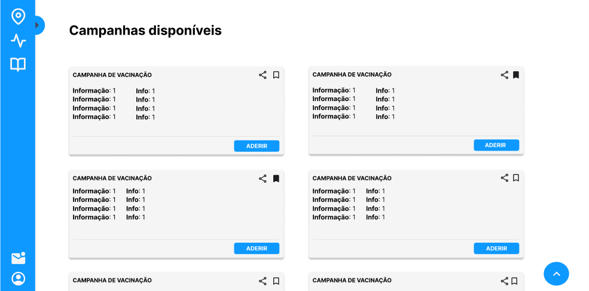
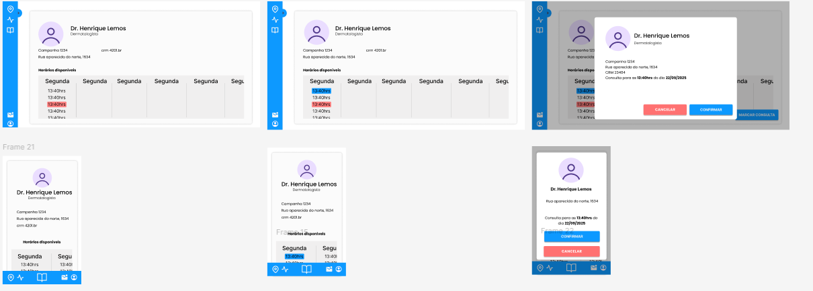
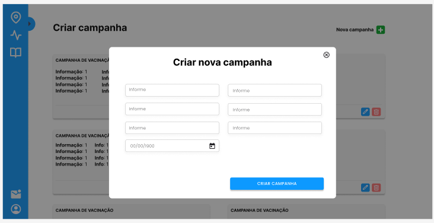

# Projeto de Interface

Pré-requisitos: <a href="2-Especificação do Projeto.md"> Documentação de Especificação</a>

Visão geral da interação do usuário pelas telas do sistema e protótipo interativo das telas com as funcionalidades que fazem parte do sistema (wireframes).

 Apresente as principais interfaces da plataforma. Discuta como ela foi elaborada de forma a atender os requisitos funcionais, não funcionais e histórias de usuário abordados nas <a href="2-Especificação do Projeto.md"> Documentação de Especificação</a>.

## Diagrama de Fluxo

O artefato abaixo abrange os fluxos de usuário para cadastro, login e recuperação de senha. Além disso, há as funcionalidades mapeadas pertinentes ao Paciente, Médico e Clínica com suas ações no Cuida+.

Link para o Miro onde foi confeccionado o Diagrama de Fluxo: https://miro.com/welcomeonboard/dUZBRlJLVWg2WnZIbGhENzJmQ00va09mS1JUZVRadEsva2ttR0hEQ1MwUWl0UEFEeFNiVlVOa1BjSEVCUUtHQUl1WUllM25yRFV6Um5LVEp5V3RCRzBuYThmNDJQak9zSUZ6NndQMGxLTlQ1dnNKV0tjK2NzMEtBeVBPZElnSmd0R2lncW1vRmFBVnlLcVJzTmdFdlNRPT0hdjE=?share_link_id=31872150649

## Wireframes

Os wireframes são protótipos utilizados no design de interfaces para representar a estrutura de um site e o relacionamento entre suas páginas. Eles funcionam como ilustrações do layout e da disposição dos elementos essenciais da interface.

Nesta seção, é FUNDAMENTAL indicar, para cada tela/wireframe proposto, quais requisitos do projeto estão sendo contemplados por aquela tela.

# Wireframes

## Requisito da tela: RF-07	- O médico voluntário deve poder aderir campanhas, consultar e remarcar consultas médicas no sistema

## Requisito da tela: RF-02 -	O paciente deve poder agendar, consultar e cancelar suas consultas médicas no sistema

## Requisito da tela: RF-05	- O consultório médico deve poder cadastrar, consultar, alterar e excluir campanhas do sistema

## Links do wireframe interativo

### Todas as telas
https://www.figma.com/design/eJwUkAUYGU4GgmvTJS8sp9/Cuida-?node-id=26-38&t=sHNMz5c3Qim0ovl9-0

### Fluxo paciente
https://www.figma.com/proto/eJwUkAUYGU4GgmvTJS8sp9/Cuida-?node-id=1-163&t=own1Bo5a3HUWQdHs-0&scaling=min-zoom&content-scaling=fixed&page-id=0%3A1&starting-point-node-id=26%3A38&show-proto-sidebar=1

### Fluxo do médico
https://www.figma.com/proto/eJwUkAUYGU4GgmvTJS8sp9/Cuida-?node-id=61-3797&t=own1Bo5a3HUWQdHs-0&scaling=min-zoom&content-scaling=fixed&page-id=0%3A1&starting-point-node-id=61%3A3797&show-proto-sidebar=1

### Fluxo da clinica
https://www.figma.com/proto/eJwUkAUYGU4GgmvTJS8sp9/Cuida-?node-id=63-390&t=own1Bo5a3HUWQdHs-0&scaling=min-zoom&content-scaling=fixed&page-id=0%3A1&starting-point-node-id=26%3A38&show-proto-sidebar=1

 
> **Links Úteis**:
> - [Protótipos vs Wireframes](https://www.nngroup.com/videos/prototypes-vs-wireframes-ux-projects/)
> - [Ferramentas de Wireframes](https://rockcontent.com/blog/wireframes/)
> - [MarvelApp](https://marvelapp.com/developers/documentation/tutorials/)
> - [Figma](https://www.figma.com/)
> - [Adobe XD](https://www.adobe.com/br/products/xd.html#scroll)
> - [Axure](https://www.axure.com/edu) (Licença Educacional)
> - [InvisionApp](https://www.invisionapp.com/) (Licença Educacional)
